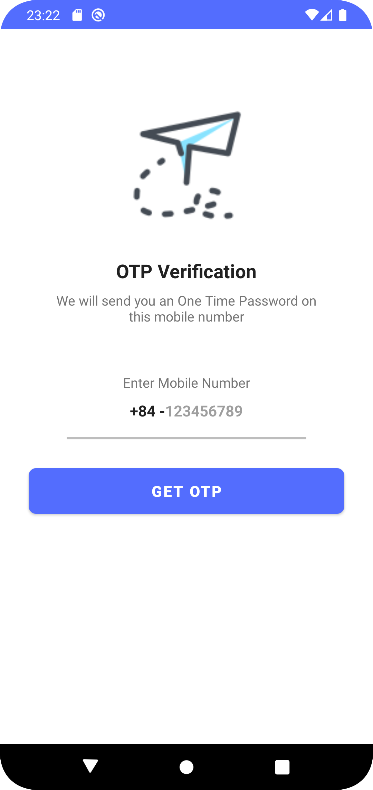

## android-otp-verification
## *NOTE: This OTP Verification Application only works on Physical Device, not working on emulator

<pre>
       
</pre>

##

 
 

 
# Firebase implementation:

    
    implementation platform('com.google.firebase:firebase-bom:31.0.0')
    implementation 'com.google.firebase:firebase-auth:20.0.0'
    
    //help firebase to open the browser for reCAPTCHA verification.
    implementation 'androidx.browser:browser:1.2.0' 
    
# 🌐Socials
    

---

